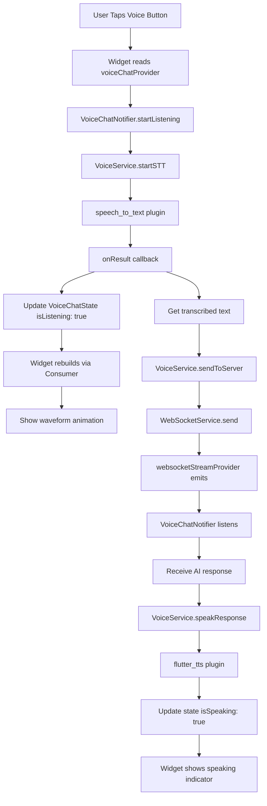
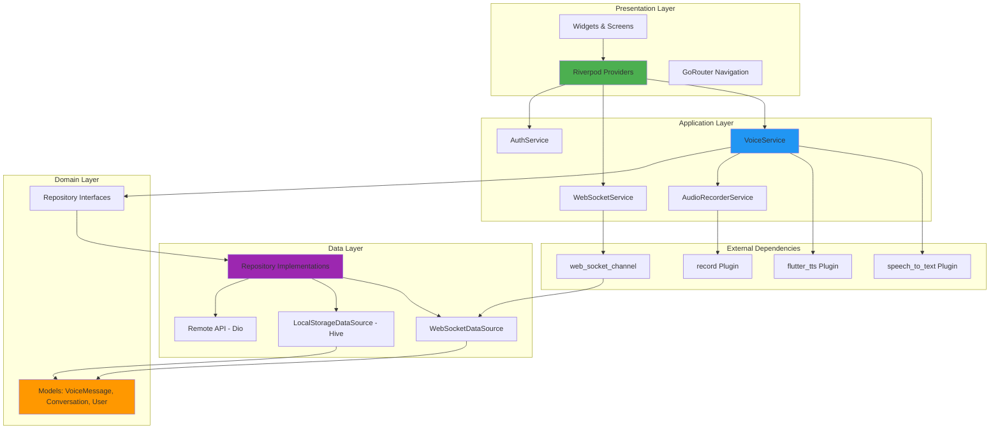
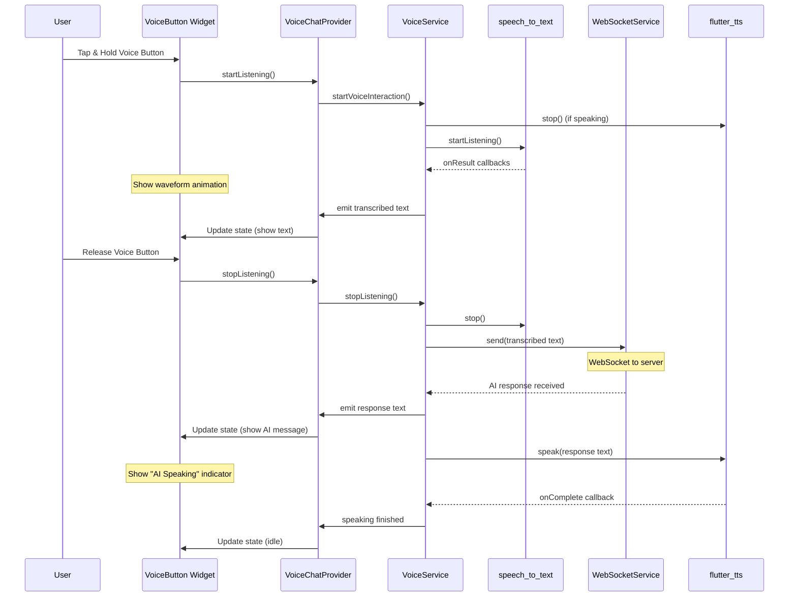

# Flutter Voice App Architecture - Friday Voice App

**Research Date:** 2026-02-06  
**Target Platforms:** Android, iOS, Web  
**Architecture Pattern:** Feature-First with Clean Architecture Layers

---

## Table of Contents

1. [Executive Summary](#executive-summary)
2. [Package Research & Selection](#package-research--selection)
3. [Architecture Design](#architecture-design)
4. [Project Structure](#project-structure)
5. [State Management Strategy](#state-management-strategy)
6. [Service Layer Design](#service-layer-design)
7. [Platform-Specific Code Handling](#platform-specific-code-handling)
8. [Offline Support Strategy](#offline-support-strategy)
9. [Security Considerations](#security-considerations)
10. [Testing Strategy](#testing-strategy)
11. [Dependencies](#dependencies)

---

## Executive Summary

Friday Voice App will be a production-ready, cross-platform voice chat application built with Flutter. After comprehensive research of Flutter packages, architecture patterns, and best practices, the following decisions have been made:

**Core Technology Stack:**
- **State Management:** Riverpod 2.0 (modern, flexible, testable)
- **Speech-to-Text:** speech_to_text (7000+ likes, mature, multi-platform)
- **Text-to-Speech:** flutter_tts (3000+ likes, comprehensive features)
- **WebSocket:** web_socket_channel (official Dart team, 1000+ likes)
- **Audio Recording:** record (2000+ likes, modern API, excellent codec support)

**Architecture Pattern:** Feature-First with Clean Architecture (4 layers)

---

## Package Research & Selection

### 1. Speech-to-Text

#### Research Results:

**Package: `speech_to_text`** ✅ SELECTED
- **Publisher:** csdcorp
- **Likes:** 7000+ (pub.dev)
- **Latest Version:** 7.3.0 (Aug 2025)
- **Platform Support:** ✅ Android, ✅ iOS, ✅ macOS, ✅ Web, ⚠️ Windows (beta)
- **Status:** Production-ready, actively maintained

**Key Features:**
- Device-native speech recognition (iOS: AVFoundation, Android: SpeechRecognizer)
- Continuous listening with pause/resume
- Multiple language support (locale detection)
- Sound feedback (iOS custom sounds)
- Permission handling built-in
- Progress callbacks (`onResult`, `onStatus`, `onError`)

**Alternatives Considered:**
- `flutter_speech_to_text` - New package (2025), insufficient production usage
- `speech_to_text_ultra` - Niche use case (pause workarounds), not mainstream

**Why `speech_to_text` Wins:**
- Most mature and widely adopted (7+ years in production)
- Excellent documentation and example apps
- Active community support (GitHub issues resolved quickly)
- Provider integration example available
- Works seamlessly across all target platforms

**Known Limitations:**
- Android: Brief pause timeout (5 seconds, OS limitation)
- Web: Browser-dependent (Chrome/Edge work best)
- iOS: Requires microphone usage description in Info.plist

---

### 2. Text-to-Speech

**Package: `flutter_tts`** ✅ SELECTED
- **Publisher:** dlutton (trusted contributor)
- **Likes:** 3000+ (pub.dev)
- **Latest Version:** Active development
- **Platform Support:** ✅ Android, ✅ iOS, ✅ Web, ✅ Windows, ✅ macOS
- **Status:** Production-ready

**Key Features:**
- Cross-platform native TTS (iOS: AVSpeechSynthesizer, Android: TextToSpeech)
- Voice selection (get available voices, set preferred voice)
- Speech rate, volume, pitch control
- Language availability checks
- Pause/resume support (iOS, Android, Web)
- Synthesize to file (iOS 13+, Android, macOS)
- Audio session category control (iOS - critical for background music mixing)
- Progress handlers (word-level callbacks)

**Alternatives Considered:**
- Platform channels (custom implementation) - Rejected: reinventing the wheel
- Online TTS APIs (Google Cloud, ElevenLabs) - Rejected: requires internet, latency issues

**Why `flutter_tts` Wins:**
- Most comprehensive feature set
- Excellent iOS audio session management (critical for voice apps)
- Works offline (device-native)
- Well-maintained with regular updates
- Supports advanced features like SSML (platform-dependent)

**Implementation Notes:**
- Set shared audio instance on iOS for background compatibility
- Use audio categories to mix with other audio sources
- Await speak completion for synchronous voice interactions

---

### 3. WebSocket Client

**Package: `web_socket_channel`** ✅ SELECTED
- **Publisher:** dart.dev (official Dart team)
- **Likes:** 1200+ (pub.dev)
- **Status:** Official, production-ready
- **Platform Support:** ✅ All platforms (uses dart:io and dart:html under the hood)

**Key Features:**
- Cross-platform abstraction (IOWebSocketChannel + HtmlWebSocketChannel)
- StreamChannel API (stream/sink pattern)
- Built-in status codes (proper WebSocket close handling)
- Protocol negotiation support
- Automatic platform detection

**Alternatives Considered:**
- `socket_io_client` (1500+ likes) - Rejected: overkill for simple WebSocket, adds Socket.IO protocol overhead
- `web_socket` (dart:io) - Rejected: platform-specific, no web support

**Why `web_socket_channel` Wins:**
- Official Dart package (maintained by core team)
- Simple, clean API following Dart conventions
- No unnecessary protocol overhead
- Excellent integration with streams (fits Riverpod/Bloc patterns)
- Mature and stable

**Usage Pattern:**
```dart
final channel = WebSocketChannel.connect(Uri.parse('wss://api.friday.ai/ws'));
await channel.ready;
channel.stream.listen((message) {
  // Handle incoming messages
});
channel.sink.add('Hello Friday!');
channel.sink.close(status.normalClosure);
```

---

### 4. State Management

**Package: `flutter_riverpod`** ✅ SELECTED
- **Publisher:** rrousselGit (Riverpod creator, Flutter GDE)
- **Likes:** 5000+ (pub.dev)
- **Version:** 2.5+ (latest stable)
- **Status:** Production-ready, industry standard

**Why Riverpod Over Bloc and Provider:**

| Feature | Riverpod | Bloc | Provider |
|---------|----------|------|----------|
| Boilerplate | Low | High | Medium |
| Testability | Excellent | Excellent | Good |
| Compile-time safety | ✅ Yes | ⚠️ Partial | ❌ No |
| DevTools support | ✅ | ✅ | ✅ |
| Learning curve | Medium | Steep | Easy |
| Async support | Native | Via streams | Manual |
| Code generation | Optional | Required | No |
| Scalability | Excellent | Excellent | Limited |

**Decision Rationale:**
1. **Riverpod chosen for Friday Voice App because:**
   - Modern, flexible provider-based architecture
   - No BuildContext dependency (easier testing, better separation)
   - Built-in dependency injection
   - Excellent async state handling (critical for voice/WebSocket)
   - Code generation optional (can start simple, add later)
   - Family/autoDispose modifiers reduce boilerplate

2. **Bloc rejected because:**
   - High boilerplate (events, states, blocs for every feature)
   - Steeper learning curve for team
   - Stream-heavy (can complicate simple use cases)

3. **Provider rejected because:**
   - Lacks compile-time safety (runtime errors)
   - Being phased out in favor of Riverpod
   - Less suitable for complex async flows

**Riverpod Architecture Layers:**
- **Providers:** StateNotifierProvider, FutureProvider, StreamProvider
- **State Classes:** Immutable state models (freezed recommended)
- **Notifiers:** Business logic controllers

---

### 5. Audio Recording

**Package: `record`** ✅ SELECTED
- **Publisher:** llfbandit
- **Likes:** 2000+ (pub.dev)
- **Latest Version:** Active development
- **Platform Support:** ✅ Android (23+), ✅ iOS (12+), ✅ Web, ✅ Windows, ✅ macOS, ⚠️ Linux (requires ffmpeg)
- **Status:** Production-ready

**Key Features:**
- Modern, clean API
- Multiple codecs: AAC-LC, AAC-ELD, Opus, WAV, FLAC, PCM16
- Stream recording (real-time audio processing)
- File recording (local storage)
- Pause/resume support
- Amplitude monitoring (dBFS - useful for voice activity detection)
- Permission handling
- Device selection (Bluetooth, microphone)
- Auto gain, echo cancellation, noise suppression (platform-dependent)

**Alternatives Considered:**
- `flutter_sound` (5000+ likes) - Feature-rich but more complex API, heavier dependency
- `audio_recorder` - Deprecated, not maintained

**Why `record` Wins:**
- Simpler API (fits "do one thing well" philosophy)
- Modern implementation (no legacy cruft)
- Excellent codec support (Opus for streaming, AAC for files)
- Stream mode perfect for real-time voice processing
- Active maintenance and quick issue resolution

**Codec Selection Strategy:**
- **Streaming to server:** Opus (low latency, excellent compression)
- **Local recording:** AAC-LC (best compatibility)
- **Voice processing:** PCM16 (raw, no encoding overhead)

---

## Architecture Design

### Architecture Philosophy

Friday Voice App follows **Feature-First Clean Architecture**, combining:
- **Feature-First Structure:** Organize by domain/feature, not by layer
- **Clean Architecture Layers:** Separation of concerns (Presentation, Application, Domain, Data)
- **Dependency Inversion:** Layers depend on abstractions, not implementations

**Why Feature-First?**

Based on research from Andrea Bizzotto's authoritative article on Flutter architecture:
- **Scalability:** Easier to add/remove features without touching unrelated code
- **Team Collaboration:** Multiple developers work on isolated features
- **Code Locality:** Related files live together (reduce cognitive load)
- **Domain-Driven:** Structure follows business requirements, not UI

**Why Not Layer-First?**
- Files for same feature scattered across project
- Hard to delete features (easy to miss files)
- Doesn't scale beyond 10-15 features

---

### Architecture Layers

```
┌─────────────────────────────────────────────────┐
│          PRESENTATION LAYER                     │
│  (Widgets, Screens, Controllers/Notifiers)      │
│  • Riverpod Providers & Notifiers               │
│  • UI State Management                          │
│  • User Input Handling                          │
└────────────────┬────────────────────────────────┘
                 │ Uses
                 ↓
┌─────────────────────────────────────────────────┐
│          APPLICATION LAYER                      │
│  (Services, Use Cases, Orchestration)           │
│  • VoiceService (STT/TTS coordination)          │
│  • WebSocketService (connection management)     │
│  • AudioRecorderService                         │
│  • Business Logic / Workflows                   │
└────────────────┬────────────────────────────────┘
                 │ Uses
                 ↓
┌─────────────────────────────────────────────────┐
│          DOMAIN LAYER                           │
│  (Models, Entities, Value Objects)              │
│  • VoiceMessage (immutable model)               │
│  • Conversation (aggregate root)                │
│  • User, Session, etc.                          │
│  • Repository Interfaces (abstractions)         │
└────────────────┬────────────────────────────────┘
                 │ Implemented by
                 ↓
┌─────────────────────────────────────────────────┐
│          DATA LAYER                             │
│  (Repositories, Data Sources, DTOs)             │
│  • ConversationRepository (local/remote)        │
│  • WebSocketDataSource                          │
│  • LocalStorageDataSource (Hive/SharedPrefs)    │
│  • DTOs (JSON serialization)                    │
└─────────────────────────────────────────────────┘
```

**Layer Responsibilities:**

1. **Presentation:** 
   - UI widgets (Material/Cupertino)
   - Riverpod providers and state notifiers
   - Navigation logic
   - Input validation (UI-level)

2. **Application:**
   - Service classes (stateless, reusable)
   - Use case orchestration (e.g., "send voice message" workflow)
   - Cross-cutting concerns (logging, analytics)

3. **Domain:**
   - Pure Dart models (no Flutter imports)
   - Business rules and validation
   - Repository contracts (interfaces)

4. **Data:**
   - Repository implementations
   - API clients, WebSocket clients
   - Local database (Hive, SQLite)
   - DTO ↔ Model mapping

---

## Project Structure

```
lib/
├── main.dart                          # App entry point
├── app.dart                           # MaterialApp setup, theme, routing
│
├── core/                              # Shared infrastructure
│   ├── constants/
│   │   ├── app_constants.dart        # API URLs, timeouts, etc.
│   │   └── voice_constants.dart      # STT/TTS defaults
│   ├── error/
│   │   ├── exceptions.dart           # Custom exceptions
│   │   └── failures.dart             # Either<Failure, Success> pattern
│   ├── network/
│   │   └── network_info.dart         # Connectivity checks
│   ├── utils/
│   │   ├── logger.dart               # Logging utility
│   │   └── validators.dart           # Common validators
│   └── widgets/                       # Common reusable widgets
│       ├── loading_indicator.dart
│       ├── error_widget.dart
│       └── voice_wave_indicator.dart
│
├── features/                          # Feature modules (feature-first)
│   │
│   ├── authentication/                # User authentication
│   │   ├── presentation/
│   │   │   ├── screens/
│   │   │   │   ├── login_screen.dart
│   │   │   │   └── register_screen.dart
│   │   │   ├── widgets/
│   │   │   │   └── auth_form.dart
│   │   │   └── providers/
│   │   │       └── auth_provider.dart
│   │   ├── application/
│   │   │   └── auth_service.dart
│   │   ├── domain/
│   │   │   ├── models/
│   │   │   │   └── user.dart
│   │   │   └── repositories/
│   │   │       └── auth_repository.dart
│   │   └── data/
│   │       ├── repositories/
│   │       │   └── auth_repository_impl.dart
│   │       ├── data_sources/
│   │       │   └── auth_remote_data_source.dart
│   │       └── dtos/
│   │           └── user_dto.dart
│   │
│   ├── voice_chat/                    # Main voice interaction feature
│   │   ├── presentation/
│   │   │   ├── screens/
│   │   │   │   ├── voice_chat_screen.dart
│   │   │   │   └── conversation_history_screen.dart
│   │   │   ├── widgets/
│   │   │   │   ├── voice_button.dart
│   │   │   │   ├── message_bubble.dart
│   │   │   │   ├── waveform_visualizer.dart
│   │   │   │   └── status_indicator.dart
│   │   │   └── providers/
│   │   │       ├── voice_chat_provider.dart
│   │   │       └── audio_playback_provider.dart
│   │   ├── application/
│   │   │   ├── services/
│   │   │   │   ├── voice_service.dart          # Coordinates STT/TTS
│   │   │   │   ├── websocket_service.dart      # WebSocket management
│   │   │   │   └── audio_recorder_service.dart # Recording logic
│   │   │   └── use_cases/
│   │   │       ├── send_voice_message.dart
│   │   │       └── process_voice_response.dart
│   │   ├── domain/
│   │   │   ├── models/
│   │   │   │   ├── voice_message.dart
│   │   │   │   ├── conversation.dart
│   │   │   │   └── audio_chunk.dart
│   │   │   └── repositories/
│   │   │       └── conversation_repository.dart
│   │   └── data/
│   │       ├── repositories/
│   │       │   └── conversation_repository_impl.dart
│   │       ├── data_sources/
│   │       │   ├── websocket_data_source.dart
│   │       │   └── local_storage_data_source.dart
│   │       └── dtos/
│   │           └── voice_message_dto.dart
│   │
│   ├── settings/                      # App settings
│   │   ├── presentation/
│   │   │   ├── screens/
│   │   │   │   └── settings_screen.dart
│   │   │   └── providers/
│   │   │       └── settings_provider.dart
│   │   ├── domain/
│   │   │   └── models/
│   │   │       └── app_settings.dart
│   │   └── data/
│   │       └── repositories/
│   │           └── settings_repository_impl.dart
│   │
│   └── profile/                       # User profile
│       └── ... (similar structure)
│
├── routing/
│   ├── app_router.dart                # GoRouter/AutoRoute config
│   └── route_guards.dart              # Auth guards, etc.
│
└── theme/
    ├── app_theme.dart                 # Light/dark themes
    └── app_colors.dart                # Color palette

test/
└── (mirrors lib/ structure)
```

**Key Principles:**
1. **Feature folders contain all layers** - easy to find related code
2. **Core folder for shared code** - but kept minimal (avoid dumping ground)
3. **Each feature is self-contained** - can be developed/tested independently
4. **Test structure mirrors lib/** - easy navigation

---

## State Management Strategy

### Riverpod Provider Types Usage

```dart
// 1. StateNotifierProvider - Complex state with mutations
final voiceChatProvider = StateNotifierProvider<VoiceChatNotifier, VoiceChatState>(
  (ref) => VoiceChatNotifier(
    voiceService: ref.watch(voiceServiceProvider),
    websocketService: ref.watch(websocketServiceProvider),
  ),
);

class VoiceChatState {
  final bool isListening;
  final bool isSpeaking;
  final List<VoiceMessage> messages;
  final VoiceConnectionStatus status;
  
  const VoiceChatState({
    this.isListening = false,
    this.isSpeaking = false,
    this.messages = const [],
    this.status = VoiceConnectionStatus.disconnected,
  });
  
  VoiceChatState copyWith({...}) => ...;
}

// 2. StreamProvider - WebSocket messages
final websocketStreamProvider = StreamProvider<WebSocketMessage>((ref) {
  final service = ref.watch(websocketServiceProvider);
  return service.messageStream;
});

// 3. FutureProvider - Async initialization
final availableVoicesProvider = FutureProvider<List<Voice>>((ref) async {
  final ttsService = ref.watch(ttsServiceProvider);
  return ttsService.getAvailableVoices();
});

// 4. Provider - Service singletons
final voiceServiceProvider = Provider<VoiceService>((ref) {
  return VoiceService(
    stt: ref.watch(sttServiceProvider),
    tts: ref.watch(ttsServiceProvider),
  );
});

// 5. FutureProvider with autoDispose - One-off operations
final sendMessageProvider = FutureProvider.autoDispose.family<void, String>(
  (ref, message) async {
    final service = ref.watch(voiceServiceProvider);
    await service.sendMessage(message);
  },
);
```

### State Flow Architecture



### Error Handling Pattern

```dart
class VoiceChatNotifier extends StateNotifier<AsyncValue<VoiceChatState>> {
  VoiceChatNotifier(...) : super(const AsyncValue.data(VoiceChatState()));
  
  Future<void> startListening() async {
    state = const AsyncValue.loading();
    
    try {
      await _voiceService.startListening();
      state = AsyncValue.data(
        state.value!.copyWith(isListening: true),
      );
    } catch (error, stack) {
      state = AsyncValue.error(error, stack);
    }
  }
}

// In widget:
Consumer(
  builder: (context, ref, child) {
    final voiceState = ref.watch(voiceChatProvider);
    
    return voiceState.when(
      data: (state) => VoiceChatUI(state: state),
      loading: () => LoadingIndicator(),
      error: (error, stack) => ErrorWidget(error: error),
    );
  },
)
```

---

## Service Layer Design

### VoiceService (Application Layer)

**Responsibility:** Coordinate STT, TTS, and audio recording

```dart
class VoiceService {
  final SpeechToTextService _stt;
  final TextToSpeechService _tts;
  final AudioRecorderService _recorder;
  
  VoiceService({
    required SpeechToTextService stt,
    required TextToSpeechService tts,
    required AudioRecorderService recorder,
  }) : _stt = stt, _tts = tts, _recorder = recorder;
  
  // High-level workflow methods
  Future<void> startVoiceInteraction() async {
    await _tts.stop(); // Stop any ongoing speech
    await _recorder.prepare(); // Warm up recorder
    await _stt.startListening(
      onResult: _handleSpeechResult,
      onError: _handleSpeechError,
    );
  }
  
  Future<void> speakResponse(String text) async {
    await _stt.stopListening(); // Don't listen while speaking
    await _tts.speak(text);
  }
  
  Stream<AudioChunk> get audioStream => _recorder.audioStream;
  
  void _handleSpeechResult(String text, bool isFinal) {
    // Emit to controller/provider
  }
}
```

### WebSocketService (Application Layer)

**Responsibility:** Manage WebSocket connection lifecycle

```dart
class WebSocketService {
  WebSocketChannel? _channel;
  final StreamController<WebSocketMessage> _messageController;
  Timer? _reconnectTimer;
  
  Stream<WebSocketMessage> get messageStream => _messageController.stream;
  
  Future<void> connect(String url) async {
    _channel = WebSocketChannel.connect(Uri.parse(url));
    await _channel!.ready;
    
    _channel!.stream.listen(
      _handleMessage,
      onError: _handleError,
      onDone: _handleConnectionClosed,
    );
  }
  
  void send(Map<String, dynamic> data) {
    if (_channel == null) throw WebSocketNotConnectedException();
    _channel!.sink.add(jsonEncode(data));
  }
  
  void _handleConnectionClosed() {
    // Exponential backoff reconnect
    _reconnectTimer = Timer(
      Duration(seconds: min(30, pow(2, _reconnectAttempts).toInt())),
      () => connect(_lastUrl),
    );
  }
  
  Future<void> dispose() async {
    _reconnectTimer?.cancel();
    await _channel?.sink.close(status.goingAway);
    await _messageController.close();
  }
}
```

### AudioRecorderService (Application Layer)

**Responsibility:** Abstract audio recording with different modes

```dart
class AudioRecorderService {
  final AudioRecorder _recorder = AudioRecorder();
  
  // Mode 1: File recording (for saving conversations)
  Future<String> recordToFile(String path) async {
    if (!await _recorder.hasPermission()) {
      throw MicrophonePermissionDeniedException();
    }
    
    await _recorder.start(
      const RecordConfig(
        encoder: AudioEncoder.aacLc,
        bitRate: 128000,
        sampleRate: 44100,
      ),
      path: path,
    );
    
    // Return path when stopped
    return await _recorder.stop() ?? '';
  }
  
  // Mode 2: Stream recording (for real-time STT)
  Stream<Uint8List> recordToStream() async* {
    if (!await _recorder.hasPermission()) {
      throw MicrophonePermissionDeniedException();
    }
    
    final stream = await _recorder.startStream(
      const RecordConfig(
        encoder: AudioEncoder.pcm16bits,
        numChannels: 1,
        sampleRate: 16000, // Optimal for speech recognition
      ),
    );
    
    yield* stream;
  }
  
  // Utility: Voice activity detection
  Stream<double> get amplitudeStream async* {
    while (_recorder.isRecording) {
      final amplitude = await _recorder.getAmplitude();
      yield amplitude.current; // dBFS value
      await Future.delayed(const Duration(milliseconds: 100));
    }
  }
}
```

---

## Platform-Specific Code Handling

### Platform Detection Strategy

**1. Use `Platform.is*` for runtime logic:**

```dart
import 'dart:io' show Platform;

class VoiceConfig {
  static RecordConfig get platformOptimizedConfig {
    if (Platform.isIOS || Platform.isMacOS) {
      return const RecordConfig(
        encoder: AudioEncoder.aacLc,
        bitRate: 128000,
        sampleRate: 44100,
      );
    } else if (Platform.isAndroid) {
      return const RecordConfig(
        encoder: AudioEncoder.aacLc,
        bitRate: 96000,
        sampleRate: 44100,
      );
    } else {
      // Web fallback
      return const RecordConfig(encoder: AudioEncoder.wav);
    }
  }
}
```

**2. Platform-specific UI (Material vs Cupertino):**

```dart
import 'package:flutter/material.dart';
import 'package:flutter/cupertino.dart';

class VoiceButton extends StatelessWidget {
  final VoidCallback onPressed;
  final bool isListening;
  
  @override
  Widget build(BuildContext context) {
    if (Platform.isIOS || Platform.isMacOS) {
      return CupertinoButton(
        onPressed: onPressed,
        child: Icon(isListening ? CupertinoIcons.mic : CupertinoIcons.mic_off),
      );
    }
    
    return FloatingActionButton(
      onPressed: onPressed,
      child: Icon(isListening ? Icons.mic : Icons.mic_off),
    );
  }
}
```

**3. Platform Channels (only when package unavailable):**

Create interface in `lib/core/platform/`:

```dart
// audio_session_platform.dart
abstract class AudioSessionPlatform {
  Future<void> configureAudioSession();
}

// audio_session_ios.dart (in platform folder)
class AudioSessionIOS implements AudioSessionPlatform {
  static const platform = MethodChannel('com.friday.audio_session');
  
  @override
  Future<void> configureAudioSession() async {
    await platform.invokeMethod('configureSession');
  }
}

// audio_session_android.dart
class AudioSessionAndroid implements AudioSessionPlatform {
  @override
  Future<void> configureAudioSession() async {
    // Android-specific implementation or no-op
  }
}

// Factory
AudioSessionPlatform getAudioSessionPlatform() {
  if (Platform.isIOS) return AudioSessionIOS();
  if (Platform.isAndroid) return AudioSessionAndroid();
  throw UnsupportedError('Platform not supported');
}
```

**4. Conditional imports (for web vs mobile):**

```dart
// storage_provider.dart
import 'storage_stub.dart'
    if (dart.library.io) 'storage_mobile.dart'
    if (dart.library.html) 'storage_web.dart';

// Use: getStorage() will return correct implementation
```

### Platform-Specific Permissions

**iOS (`ios/Runner/Info.plist`):**
```xml
<key>NSMicrophoneUsageDescription</key>
<string>Friday needs microphone access for voice chat</string>
<key>NSSpeechRecognitionUsageDescription</key>
<string>Friday uses speech recognition to understand your voice commands</string>
```

**Android (`android/app/src/main/AndroidManifest.xml`):**
```xml
<uses-permission android:name="android.permission.RECORD_AUDIO"/>
<uses-permission android:name="android.permission.INTERNET"/>
<uses-permission android:name="android.permission.BLUETOOTH"/>
<uses-permission android:name="android.permission.BLUETOOTH_CONNECT"/>

<queries>
  <intent>
    <action android:name="android.speech.RecognitionService" />
  </intent>
  <intent>
    <action android:name="android.intent.action.TTS_SERVICE" />
  </intent>
</queries>
```

**macOS (`macos/Runner/Info.plist`):**
```xml
<key>NSMicrophoneUsageDescription</key>
<string>Friday needs microphone access for voice chat</string>
<key>com.apple.security.device.audio-input</key>
<true/>
```

---

## Offline Support Strategy

### 1. Local Storage (Hive)

**Why Hive?**
- Fast (pure Dart, no native dependencies)
- Supports all platforms (including web via IndexedDB)
- Type-safe with adapters
- No SQL (simpler for voice message storage)

**Schema:**

```dart
// conversation_box.dart
@HiveType(typeId: 0)
class ConversationHive extends HiveObject {
  @HiveField(0)
  String id;
  
  @HiveField(1)
  List<VoiceMessageHive> messages;
  
  @HiveField(2)
  DateTime createdAt;
  
  @HiveField(3)
  bool isSynced;
}

@HiveType(typeId: 1)
class VoiceMessageHive {
  @HiveField(0)
  String id;
  
  @HiveField(1)
  String text;
  
  @HiveField(2)
  bool isFromUser;
  
  @HiveField(3)
  String? audioFilePath; // Local file path
  
  @HiveField(4)
  DateTime timestamp;
}
```

### 2. Offline Queue (for WebSocket)

```dart
class OfflineQueueService {
  final Box<PendingMessage> _queue;
  
  Future<void> enqueue(VoiceMessage message) async {
    await _queue.add(PendingMessage(
      id: message.id,
      payload: message.toJson(),
      timestamp: DateTime.now(),
    ));
  }
  
  Future<void> syncWhenOnline() async {
    if (!await NetworkInfo.isConnected) return;
    
    final pending = _queue.values.toList();
    for (final msg in pending) {
      try {
        await _websocketService.send(msg.payload);
        await _queue.delete(msg.key);
      } catch (e) {
        // Keep in queue, retry later
      }
    }
  }
}
```

### 3. Voice Assets Caching

**Pre-cache common TTS voices:**
```dart
class TTSCacheService {
  Future<void> warmUpVoice(String text) async {
    final file = await _tts.synthesizeToFile(text, 'cache/voice_${text.hashCode}.caf');
    // Cache file path for instant playback
  }
}
```

### 4. Network-Aware State

```dart
enum NetworkStatus { online, offline, unknown }

final networkStatusProvider = StreamProvider<NetworkStatus>((ref) {
  return Connectivity().onConnectivityChanged.map((result) {
    return result != ConnectivityResult.none 
        ? NetworkStatus.online 
        : NetworkStatus.offline;
  });
});

// In UI:
final networkStatus = ref.watch(networkStatusProvider);
if (networkStatus == NetworkStatus.offline) {
  // Show offline banner
  // Disable features requiring server
}
```

---

## Security Considerations

### 1. WebSocket Security

- **Always use `wss://` (WebSocket Secure)** in production
- Implement JWT token refresh on connection
- Validate all incoming messages (schema validation)

```dart
class SecureWebSocketService extends WebSocketService {
  final AuthRepository _auth;
  
  @override
  Future<void> connect(String url) async {
    final token = await _auth.getAccessToken();
    final secureUrl = '$url?token=$token';
    await super.connect(secureUrl);
  }
  
  void _handleMessage(dynamic rawMessage) {
    try {
      final validated = WebSocketMessageSchema.validate(rawMessage);
      super._handleMessage(validated);
    } catch (e) {
      // Log security incident, ignore malicious message
    }
  }
}
```

### 2. Audio Data Privacy

- **Never upload audio without user consent**
- **Delete temporary recordings** after processing
- **Encrypt local storage** (Hive supports encryption)

```dart
await Hive.openBox<ConversationHive>(
  'conversations',
  encryptionCipher: HiveAesCipher(encryptionKey),
);
```

### 3. Permission Handling

```dart
class PermissionService {
  Future<bool> requestMicrophonePermission() async {
    // Always explain why before requesting
    final shouldRequest = await _showPermissionRationale();
    if (!shouldRequest) return false;
    
    final granted = await Permission.microphone.request().isGranted;
    
    if (!granted) {
      await _showPermissionDeniedDialog();
    }
    
    return granted;
  }
}
```

### 4. Input Validation

**Sanitize all text before TTS:**
```dart
String sanitizeForTTS(String input) {
  // Remove potentially harmful SSML tags
  return input.replaceAll(RegExp(r'<[^>]*>'), '');
}
```

---

## Testing Strategy

### 1. Unit Tests (Domain & Application layers)

```dart
// test/features/voice_chat/domain/models/voice_message_test.dart
void main() {
  group('VoiceMessage', () {
    test('should create valid voice message', () {
      final message = VoiceMessage(
        id: '1',
        text: 'Hello',
        isFromUser: true,
        timestamp: DateTime.now(),
      );
      
      expect(message.text, 'Hello');
      expect(message.isFromUser, true);
    });
  });
}

// test/features/voice_chat/application/services/voice_service_test.dart
void main() {
  late VoiceService voiceService;
  late MockSpeechToTextService mockSTT;
  late MockTextToSpeechService mockTTS;
  
  setUp(() {
    mockSTT = MockSpeechToTextService();
    mockTTS = MockTextToSpeechService();
    voiceService = VoiceService(stt: mockSTT, tts: mockTTS);
  });
  
  test('should stop TTS before starting STT', () async {
    await voiceService.startVoiceInteraction();
    
    verify(mockTTS.stop()).called(1);
    verify(mockSTT.startListening(any, any)).called(1);
  });
}
```

### 2. Widget Tests (Presentation layer)

```dart
// test/features/voice_chat/presentation/widgets/voice_button_test.dart
void main() {
  testWidgets('VoiceButton shows mic icon when not listening', (tester) async {
    await tester.pumpWidget(
      MaterialApp(
        home: VoiceButton(
          isListening: false,
          onPressed: () {},
        ),
      ),
    );
    
    expect(find.byIcon(Icons.mic_off), findsOneWidget);
  });
}
```

### 3. Integration Tests (End-to-End)

```dart
// integration_test/voice_chat_flow_test.dart
void main() {
  IntegrationTestWidgetsFlutterBinding.ensureInitialized();
  
  testWidgets('Complete voice chat flow', (tester) async {
    app.main();
    await tester.pumpAndSettle();
    
    // Tap voice button
    await tester.tap(find.byType(VoiceButton));
    await tester.pumpAndSettle();
    
    // Verify listening state
    expect(find.byIcon(Icons.mic), findsOneWidget);
    
    // Simulate speech result (via test doubles)
    // Verify message appears in UI
  });
}
```

### 4. Golden Tests (UI consistency)

```dart
testWidgets('VoiceButton golden test', (tester) async {
  await tester.pumpWidget(VoiceButton(isListening: true, onPressed: () {}));
  await expectLater(
    find.byType(VoiceButton),
    matchesGoldenFile('goldens/voice_button_listening.png'),
  );
});
```

---

## Dependencies

### pubspec.yaml

```yaml
name: friday_voice_app
description: Production-ready Flutter voice chat application
version: 1.0.0+1

environment:
  sdk: ">=3.0.0 <4.0.0"
  flutter: ">=3.16.0"

dependencies:
  flutter:
    sdk: flutter
  
  # State Management
  flutter_riverpod: ^2.5.1         # State management (5000+ likes)
  riverpod_annotation: ^2.3.5      # Code generation (optional)
  
  # Voice/Audio
  speech_to_text: ^7.3.0           # STT (7000+ likes, production-ready)
  flutter_tts: ^4.2.0              # TTS (3000+ likes, cross-platform)
  record: ^5.1.2                   # Audio recording (2000+ likes, modern API)
  
  # Networking
  web_socket_channel: ^3.0.1       # WebSocket (official Dart, 1200+ likes)
  dio: ^5.7.0                      # HTTP client (12000+ likes)
  connectivity_plus: ^6.1.0        # Network status (4000+ likes)
  
  # Local Storage
  hive: ^2.2.3                     # NoSQL database (4000+ likes)
  hive_flutter: ^1.1.0             # Hive Flutter integration
  shared_preferences: ^2.3.3       # Simple key-value storage (5000+ likes)
  path_provider: ^2.1.5            # File system paths (5000+ likes)
  
  # Utilities
  freezed_annotation: ^2.4.4       # Immutable models
  json_annotation: ^4.9.0          # JSON serialization
  equatable: ^2.0.7                # Value equality (3000+ likes)
  uuid: ^4.5.1                     # Unique IDs
  logger: ^2.5.0                   # Logging (2000+ likes)
  intl: ^0.19.0                    # Internationalization
  
  # UI
  flutter_svg: ^2.0.10             # SVG support (4000+ likes)
  cached_network_image: ^3.4.1     # Image caching (5000+ likes)
  shimmer: ^3.0.0                  # Loading skeletons (2000+ likes)
  lottie: ^3.1.3                   # Animations (2000+ likes)
  
  # Routing
  go_router: ^14.6.2               # Declarative routing (4000+ likes, official)
  
  # Permissions
  permission_handler: ^11.3.1      # Permission management (4000+ likes)

dev_dependencies:
  flutter_test:
    sdk: flutter
  integration_test:
    sdk: flutter
  
  # Code Generation
  build_runner: ^2.4.13            # Code generation runner
  riverpod_generator: ^2.4.3       # Riverpod codegen
  freezed: ^2.5.7                  # Freezed codegen
  json_serializable: ^6.8.0        # JSON codegen
  hive_generator: ^2.0.1           # Hive adapters
  
  # Testing
  mockito: ^5.4.4                  # Mocking (3000+ likes)
  bloc_test: ^9.1.7                # State testing helpers
  fake_async: ^1.3.1               # Async testing
  
  # Analysis
  flutter_lints: ^5.0.0            # Official lints
  very_good_analysis: ^6.0.0       # Stricter lints (optional)

flutter:
  uses-material-design: true
  
  assets:
    - assets/images/
    - assets/icons/
    - assets/sounds/                # iOS STT sounds (optional)
    - assets/animations/             # Lottie files
  
  fonts:
    - family: Inter
      fonts:
        - asset: assets/fonts/Inter-Regular.ttf
        - asset: assets/fonts/Inter-Bold.ttf
          weight: 700
```

---

## Architecture Diagram (Mermaid)



---

## Voice Chat Flow Diagram



---

## Implementation Checklist

### Phase 1: Foundation (Week 1)
- [ ] Initialize Flutter project with proper folder structure
- [ ] Set up Riverpod with providers
- [ ] Configure platform-specific permissions (iOS/Android/macOS)
- [ ] Implement basic navigation (GoRouter)
- [ ] Set up Hive local storage
- [ ] Create domain models (VoiceMessage, Conversation, User)

### Phase 2: Core Voice Features (Week 2-3)
- [ ] Implement SpeechToTextService wrapper
- [ ] Implement TextToSpeechService wrapper
- [ ] Implement AudioRecorderService wrapper
- [ ] Create VoiceService orchestrator
- [ ] Build VoiceButton widget with hold-to-speak
- [ ] Add waveform visualizer
- [ ] Implement voice activity detection (amplitude monitoring)

### Phase 3: Networking (Week 4)
- [ ] Implement WebSocketService with reconnection logic
- [ ] Create WebSocketDataSource
- [ ] Implement offline queue for messages
- [ ] Add network status monitoring
- [ ] Create conversation repository with local/remote sync

### Phase 4: UI & Polish (Week 5)
- [ ] Build main voice chat screen
- [ ] Create conversation history view
- [ ] Implement settings screen (voice selection, language)
- [ ] Add loading states and error handling
- [ ] Implement dark mode
- [ ] Add haptic feedback

### Phase 5: Testing & Optimization (Week 6)
- [ ] Write unit tests for services
- [ ] Write widget tests for UI components
- [ ] Integration tests for voice flow
- [ ] Performance profiling (memory, battery)
- [ ] Accessibility testing (screen readers, voice-over)

---

## Conclusion

This architecture document provides a **production-ready blueprint** for Friday Voice App. Key decisions:

1. **Riverpod for state management** - Modern, flexible, testable
2. **Feature-first structure** - Scalable, maintainable
3. **Clean architecture layers** - Clear separation of concerns
4. **Best-in-class packages** - Mature, widely-adopted, cross-platform
5. **Offline-first design** - Works without internet, syncs when available

**Next Steps:**
1. Review this document with team
2. Set up project skeleton
3. Begin Phase 1 implementation
4. Iterate based on real-world testing

**Resources:**
- [Riverpod Documentation](https://riverpod.dev/)
- [Andrea Bizzotto's Flutter Architecture Guide](https://codewithandrea.com/articles/flutter-app-architecture-riverpod-introduction/)
- [speech_to_text Package](https://pub.dev/packages/speech_to_text)
- [flutter_tts Package](https://pub.dev/packages/flutter_tts)
- [Flutter Official Docs](https://docs.flutter.dev/)

---

**Document Version:** 1.0  
**Last Updated:** 2026-02-06  
**Author:** Friday AI (Subagent Research Task)
